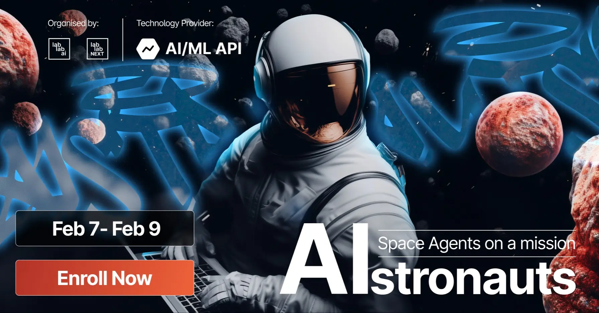

# Welcome
This is my project for a potential LabLab AI Hackathon submission for the [AIstronauts: Space Agents on a mission](https://lablab.ai/event/aistronauts-space-agents-on-a-mission?utm_medium=newsletter_paid&utm_source=email1&utm_campaign=AIstronauts) hackathon - held from **Friday, February 7th 2025 - 9:00 AM PST** to **Sunday, February 9th 2025 - 9:00 AM PST**.

Given that I am starting the project midway through the hackathon - roughly at **5:30 PM PST** on **Saturday, February 8th, 2025** - I will be curious to see what I wind up doing or creating. 😅

> 78% of people “fail” at hackathons 😅

Source: [LabLab.ai Hackathon Guide (~6:33)](https://www.youtube.com/watch?v=43PCWgt1Pn0)

## Your mission
Design an AI agent that transforms space exploration - whether by automating tasks, optimizing workflows, or solving key challenges. Build intelligent systems that create real impact!

## Ground control

Checklist of necessary steps to complete the mission:

- [ ] Create or join a team on LabLab.ai
- [ ] BRAINSTORM: 2-3 concepts for an AI agent solution that transforms space exploration
    - [ ] After generating a list of potential solutions, the team should evaluate each idea based on factors such as feasibility, scalability, profitability, and market potential.
    - [ ] Evaluate the feasibility of each idea: in terms of available AI models, required data, technical expertise, and potential impact.
    - [ ] Resource Allocation: Consider the resources (timeline of hackathon, developers, availability of API Keys) needed to implement each idea. Choose ideas that align with available resources.
- [ ] BUILD: Build a prototype for your solution
- [ ] SUBMIT: Submit your solution to the hackathon
    - [ ] Product Description
    - [ ] Presentation (not to exceed 5 minutes)
    - [ ] GitHub link with the demo
