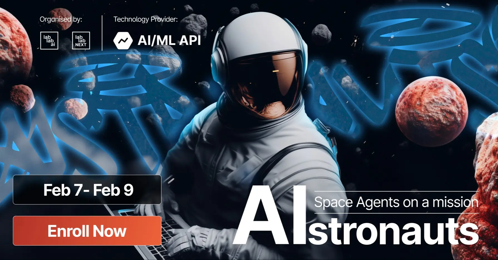
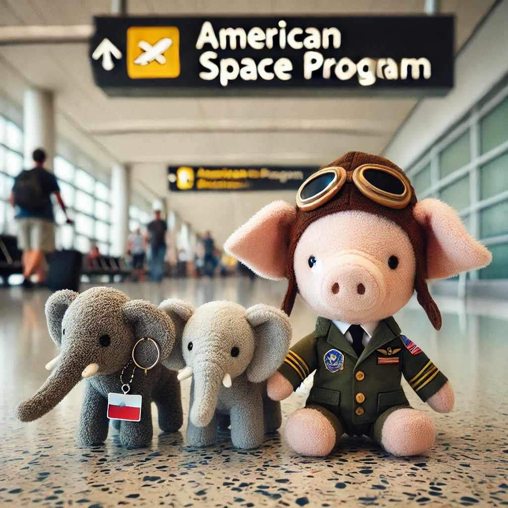

# Welcome
This is my project for a potential LabLab AI Hackathon submission for the [AIstronauts: Space Agents on a mission](https://lablab.ai/event/aistronauts-space-agents-on-a-mission) hackathon - held from **Friday, February 7th 2025 - 9:00 AM PST** to **Sunday, February 9th 2025 - 9:00 AM PST**.



Given that I am starting the project midway through the hackathon - roughly at **5:30 PM PST** on **Saturday, February 8th, 2025** - I will be curious to see what I wind up doing or creating. 😅

> 78% of people "fail" at hackathons 😅

Source: [LabLab.ai Hackathon Guide (~6:33)](https://www.youtube.com/watch?v=43PCWgt1Pn0)

> By processing data, understanding context, and executing actions, AI Agents enhance efficiency, reduce errors, and provide intelligent solutions to complex challenges.

> Their ability to operate continuously and make informed decisions based on real-time data makes them invaluable in modern technology landscapes.

Source: [LabLab.AI AIstronauts: Space Agents on a mission](https://lablab.ai/event/aistronauts-space-agents-on-a-mission)

## Demo
🚀 [View Live Demo](https://lablabai-hackathon-aistronauts-space-agents-on-a-mission.vercel.app)

## Your mission
Design an AI agent that transforms space exploration - whether by automating tasks, optimizing workflows, or solving key challenges. Build intelligent systems that create real impact!


## The Crew
Members of the American Space Program will be joining us to help us build our AI agent.



### Suggested Topics to Explore

#### Automation of Space Operations

🛰️ Problem Statement: Space missions require managing complex operations, often relying on repetitive and time-intensive tasks.

Challenge: Develop AI agents to automate mission planning, resource allocation, and communication systems, enhancing efficiency and reducing human workload.


#### Reducing Operational Inefficiencies

🚀 Problem Statement: Space agencies face challenges in optimizing resource use and minimizing waste during missions.

Challenge: Design AI agents that detect inefficiencies, optimize fuel consumption, and streamline supply chain logistics for space missions.

#### Enhancing Citizen Access to Space Data

🌌 Problem Statement: Access to space-related data and insights can be challenging for researchers, educators, and the general public.

Challenge: Build AI agents that simplify access to space data, enable educational tools, and foster citizen engagement in space exploration.

### Suggested Technologies

#### AI/ML API
AI/ML API provides advanced features like text completion, image inference, speech-to-text, and more, offering seamless integration, high performance, and secure key management.

👉 Read more about AI/ML API

#### AutoGen
AutoGen is an open-source framework simplifying the creation of multi-agent systems using LLMs, enabling coordinated AI interactions with humans and tools.

👉 Read more about [AutoGen](https://lablab.ai/tech/microsoft/autogen)

#### AgentOps
AgentOps is a platform for monitoring, debugging, and optimizing AI agents with tools like session replays, metrics dashboards, and custom reporting in real-time.

👉 Read more about [AgentOps](https://lablab.ai/tech/agentops)

#### CrewAI 
CrewAI is a modular, multi-agent framework enabling AI teams for streamlined workflows, automation, and insights, perfect for developers and businesses.

👉 Read more about [CrewAI](https://lablab.ai/tech/crew-ai)

## Ground control

Checklist of necessary steps to complete the mission:

- Create or join a team on LabLab.ai
- Review pitches from other teams for the hackathon - [OTHER_PITCHES.md](./documentation/OTHER_PITCHES.md)
- BRAINSTORM: 2-3 concepts for an AI agent solution that transforms space exploration
    - LabLab.AI AI Startup ideas - [AI_STARTUP_IDEAS.md](./documentation/LABLABAI_AI_STARTUP_IDEAS.md)
    - Brainstorming session - [BRAINSTORM.md](./documentation/BRAINSTORM.md)
    - After generating a list of potential solutions, the team should evaluate each idea based on factors such as feasibility, scalability, profitability, and market potential.
    - Evaluate the feasibility of each idea: in terms of available AI models, required data, technical expertise, and potential impact.
    - Resource Allocation: Consider the resources (timeline of hackathon, developers, availability of API Keys) needed to implement each idea. Choose ideas that align with available resources.
- BUILD: Build a prototype for your solution
    - [MVP Plan: Satellite Imagery Analysis Platform](./documentation/MVP_PLAN_SATELLITE_IMAGERY_ANALYSIS_PLATFORM.md)
- SUBMIT: Submit your solution to the hackathon per the [Submission Guidelines](https://lablab.ai/delivering-your-hackathon-solution)
    - Product Description
    - Presentation (not to exceed 5 minutes)
    - GitHub link with the demo

# Satellite Imagery Analysis Platform

## Project Structure
```
apps/
├── nextjs-web/     # Frontend application
└── python-api/     # Backend API service
```

## Setup Instructions

### Prerequisites
- Docker and Docker Compose
- Node.js 18+ (for local development)
- Python 3.11+ (for local development)
- API keys for:
  - Mapbox (for map visualization)
  - NASA Earth Data
  - OpenAI (for AI analysis)
  - Sentinel Hub (optional)

### Environment Setup

1. **Frontend Setup (nextjs-web)**
   ```bash
   cd apps/nextjs-web
   cp .env.example .env
   ```
   Add your Mapbox token to `.env`:
   ```
   NEXT_PUBLIC_MAPBOX_ACCESS_TOKEN=your_token_here
   ```

2. **Backend Setup (python-api)**
   ```bash
   cd apps/python-api
   cp .env.example .env
   ```
   Add your API keys to `.env`:
   ```
   OPENAI_API_KEY=your_openai_key_here
   NASA_API_KEY=your_nasa_key_here
   SENTINEL_HUB_API_KEY=your_sentinel_hub_key_here
   ```

### Running with Docker

1. **Start all services**
   ```bash
   docker-compose up --build
   ```
   This will start:
   - Frontend at http://localhost:3000
   - Backend API at http://localhost:8000

2. **View API documentation**
   - OpenAPI docs: http://localhost:8000/docs
   - ReDoc: http://localhost:8000/redoc

### Local Development

1. **Frontend (Next.js)**
   ```bash
   cd apps/nextjs-web
   npm install
   npm run dev
   ```

2. **Backend (FastAPI)**
   ```bash
   cd apps/python-api
   python -m venv venv
   source venv/bin/activate  # or `venv\Scripts\activate` on Windows
   pip install -r requirements.txt
   uvicorn src.main:app --reload
   ```

## API Services

The Python API provides:
- Satellite imagery fetching
- AI-powered analysis
- Change detection
- Report generation

## Available Endpoints

- `GET /health` - Health check endpoint
- `GET /api/v1/...` - API endpoints (documentation in progress)

## Development Workflow

1. Frontend changes:
   - Edit files in `apps/nextjs-web/src`
   - Changes hot-reload in development

2. Backend changes:
   - Edit files in `apps/python-api/src`
   - FastAPI auto-reloads on changes

## Troubleshooting

Common issues:
1. **Port conflicts**: Ensure ports 3000 and 8000 are available
2. **Environment variables**: Verify all required API keys are set
3. **Docker issues**: Try removing containers and rebuilding:
   ```bash
   docker-compose down
   docker-compose up --build
   ```

## Next Steps

- [ ] Implement satellite imagery fetching
- [ ] Add AI analysis capabilities
- [ ] Create map overlays
- [ ] Generate analysis reports
